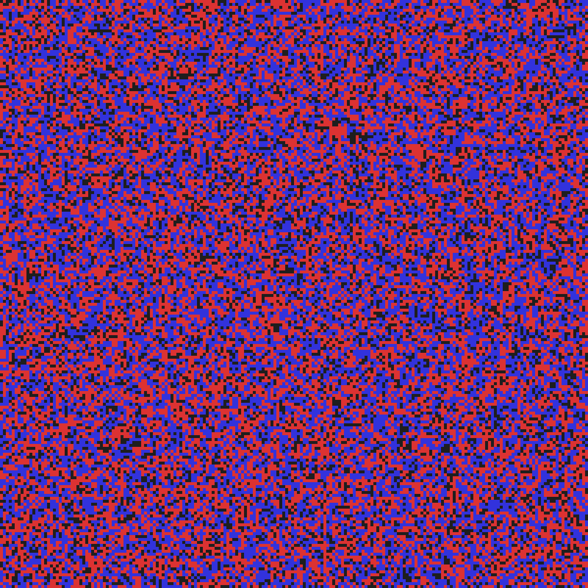
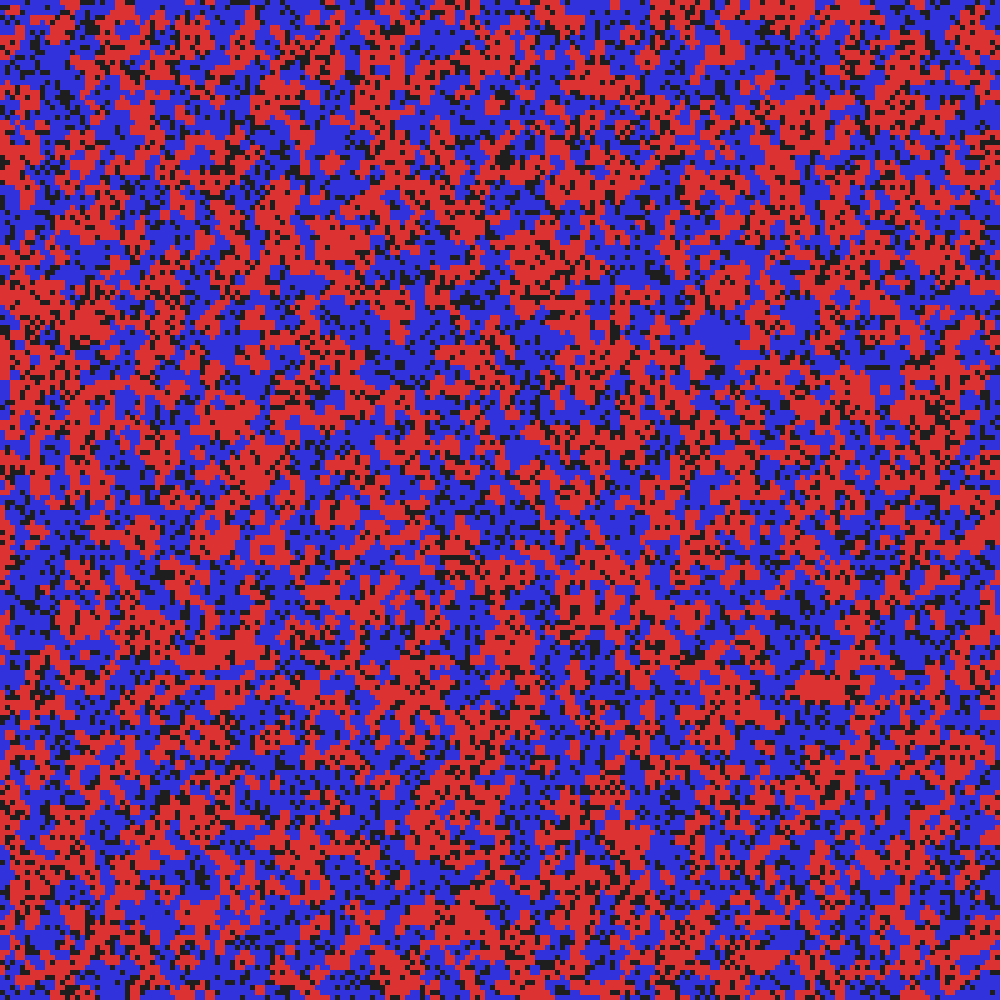
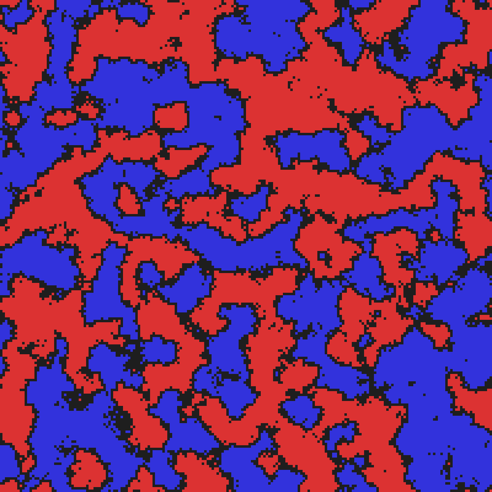
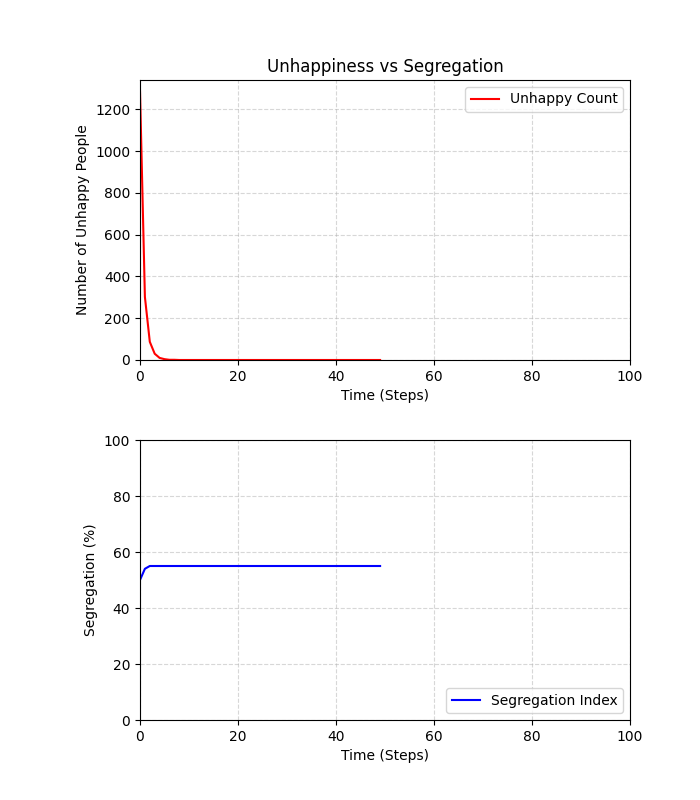
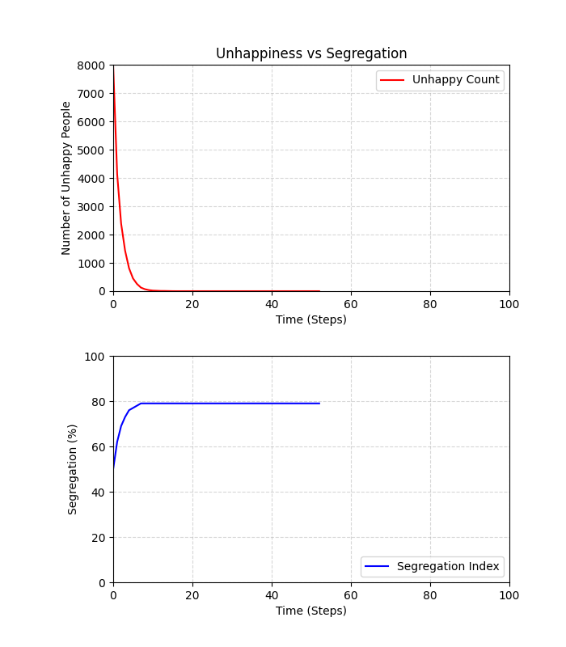
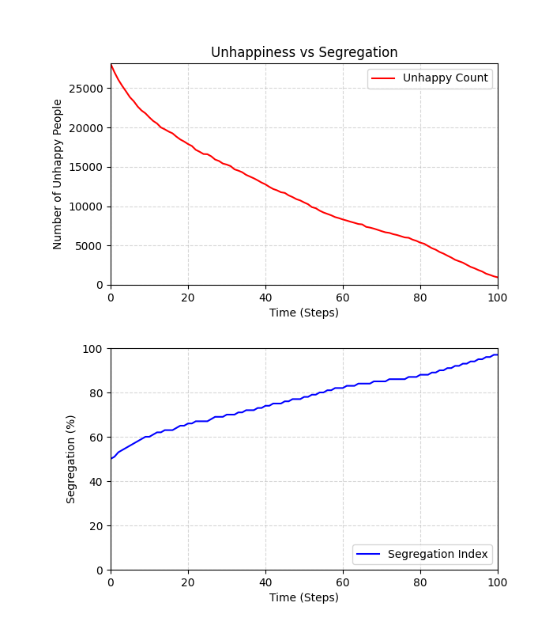

# Schelling's Model of Segregation
A toroidal-grid implementation of Thomas Schelling's famous model of segregation. This project simulates how even a generally tolerant society (tolerance of each individual is high) can lead to wide scale societal segregation, using `matplotlib` for graphs, `pygame` for simulation, and `multiprocessing` to speed up collection of data.

## Features
- **Toroidal Grid:** Uses a toroidal (wrap-around) board, simulating an infinite surface to remove any boundary bias.
- **Visual Mode:** Uses `pygame` to see how the board evolves over time, and `matplotlib` to graph time series data of 'unhappy agents' and 'measure of segregation'. Automatically saves grid state and graph state at the end of simulation to track data.
- **Non-Visual Mode:** Optimised background processing that disables rendering to maximise speed (~10x faster), and still automatically saves grid state and graph state at the end of each simulation to track data.
- **Multiprocessing:** In non-visual mode, using `multiprocessing` utilises all CPU-cores to run multiple simulations in parallel.
- **Data Collection:** Automatically saves the data to a .csv for later graphing

## Installation
1. **Clone the repo:**
    ```bash
    git clone [https://github.com/arnavlul/schellings-segregation-model.git](https://github.com/arnavlul/schellings-segregation-model/)
    cd schellings-segregation-model
    ```

2. **Install the required dependencies:**
    ```bash
    pip install numpy matplotlib pygame
    ```

## Usage
There are 2 ways to run the simulation:

1. Single simulation:
```bash
python base_model.py
```
- Input threshold (0-1)
- Input grid size (100-200 Recommended)
- Pressing `SPACE` with pygame window in focus pauses simulation
- Use sliders to adjust the graphs dynamically
- Do not move matplotlib graph if pygame window isn't paused / has stopped

2. Batch simulation:
Use this to collect data across a range of thresholds.
```bash
python tester.py
```
- Input starting and ending threshold values, precision of threshold values (0.01 recommended), visualise or not, number of times to compute at each threshold (to get average), and number of cores to use
- Saves data to csv

3. Plotting final graph:
```bash
python plotter.py
```
- Plots the schelling_stats.csv file generated if batch simulation is done

## File Structure
- `base_model.py`
- `tester.py`
- `plotter.py`
- `schelling_stats.csv`: This file will be created if the batch simulation (`tester.py`) is run
- `state_graphs/`: Where matplotlib graphs are saved
- `state_pics/`: Where pygame grids are saved

## The Model
Schelling's Model demonstrates that even having a mild individual preference (eg. Wanting only 35% of your neighbours to be like you), leads to wide scale societal segregation, with the amount of segregation increasing with increase in % of like neighbours an individual wants around.
- Threshold: The minimum % of like people, a cell wants around it to be happy.
- Segregation Index: Calculating the average similarity of every agent's neighbourhood (8 surrounding cells)

### How the model goes:
1. **Initial Distribution:** Cells are first randomly generated with the following distribution: 20% unoccupied, 40% 1 (red), and 40% 2 (blue)
2. **Scan:** At each time step, the grid is traversed; unhappy agents and unoccupied cells are noted.
3. **Relocate:** Unhappy agents are moved to a random cell.
4. **Terminate:** The loop breaks when everyone is happy, or if the system reaches a "stagnation" or "oscillation" state.

## Inferences
1. At low thresholds (1-30%), individuals are homogenously mixed.
2. After ~30-35%: communities can visibly be seen as being more segregated than not.
3. Segregation (and similarly size of communities) keeps increasing with increase in threshold.
4. At 75% and greater: The amount of like cells an individual wants exceeds a number that isn't possible. This is known as "Structural Incompatibility". This happens when the demand exceeds the available "packing density" of the grid. Say if an individual wants 90% of like cells, that isn't possible, as out of the 8 surrounding cells, even if 1 is the other colour it will turn it 87.5%, so all cells surrounding an individual NEED to be the same colour. Which isn't possible if the grid is 40-40 with the number of the 2 types of people. No stable communities can be formed, since each time the cells relocate, they are always unhappy.

## Graphs
<table>
    <tr>
        <td align="center">
            
        </td>
        <td align="center">
            
        </td>
        <td align="center">
            
        </td>
    </tr>
    <tr>
        <td align="center">
            
        </td>
        <td align="center">
            
        </td>
        <td align="center">
            
        </td>
    </tr>
    <tr>
        <td align = "center"><strong>Mixed (15%)</strong><br>Agents are happy without segregation</td>
        <td align = "center"><strong>Segregation Begins (35%)</strong><br>Agents are starting to form segregated communities</td>
        <td align = "center"><strong>Peak Segregation (74%)</strong><br>Agents are as segregated as possible (with the given rules)</td>
    </tr>
</table>

## Possible Improvements
- The code doesn't strictly stop when number of unhappy people reaches 0, it stops using 2 rules: (1) If at the last 50 steps, there isn't sufficient movement in the number of unhappy people (to combat stagnation) (2) If there is movement but the min(number of unhappy people) doesn't change in 200 steps (to combat oscillating behaviour)
- The measure of segregation is averaging the number of like people in a person's neighbourhood, which only captures local interactions. Better measures can be used, such as the 'Interface Percentage' which as far as i can tell is the standard; or number of clusters (through something like Hoshen-Kopelman)
- Right now if agents are unhappy, they randomly move to another cell. This doesn't model real life behaviour as agents wouldn't move to a cell that would make the situation worse. So better to keep track of ideal cells for an agent, and move them there; if no ideal cells, only then move the agent randomly (or some other similar method).